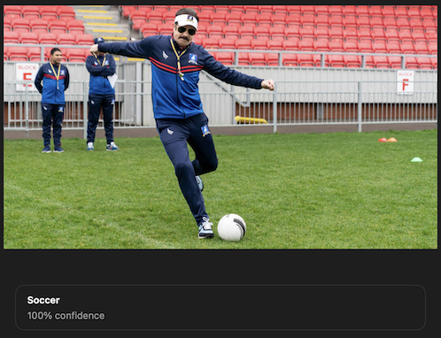
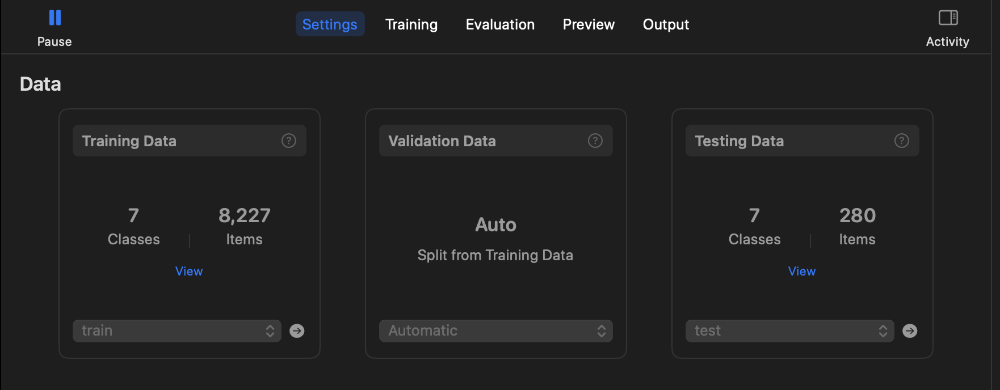
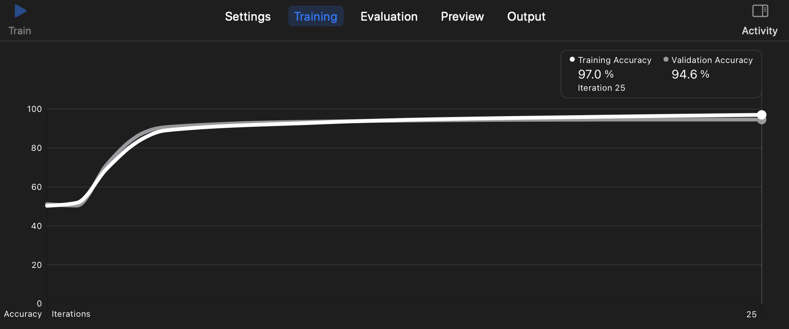
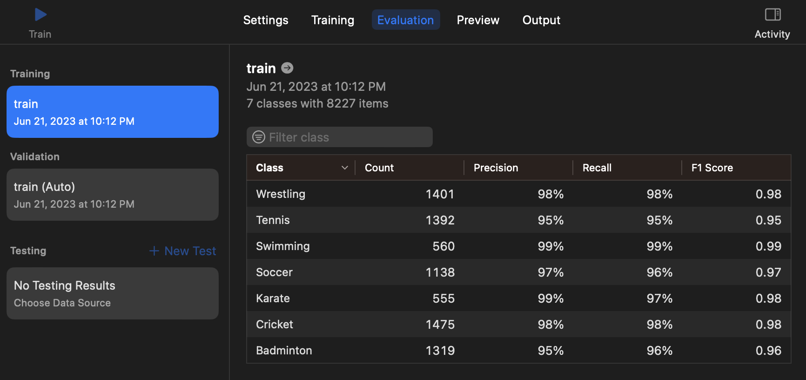

# Sports Classifier with CreateML 🏀
> #### _Archit | Summer '23 | Duke AIPI 561 MLOPS Project 2_  

&nbsp;  
## Project Description ⭐  
This repository contrain implementation of a  `Sports Image Classifier` using Apple's AutoML toolkit - [CreateML](https://developer.apple.com/machine-learning/create-ml/). The aim of this project is to create a ML model which can help classify sports images into various categories such as Badminton, Cricket, Karate, Soccer, Swimming, Tennis, Wrestling. The model is trained using Create ML, a powerful tool provided by Apple for building and training machine learning models on macOS. The trained model is capable of analyzing a given image and predicting the sport category it belongs to. This can be useful in various applications, such as organizing and categorizing sports-related images, automated tagging, and content filtering.  

For example, if the following image is input to the model, it will produce the following answer:
>    

&nbsp;  
## Dataset 📊  
The data used for training the model is taken from a [Kaggle Dataset](https://www.kaggle.com/datasets/sidharkal/sports-image-classification). It contains 7 categories of sports images - Badminton, Cricket, Karate, Soccer, Swimming, Tennis, Wrestling. The dataset contains ~8k images in total. Download the dataset from Kaggle and place it in a `data` folder.

&nbsp;  
## Creating the Image Classifier with CreateML 📁 
**1. Setup the python envrionment:**  
```
make setup
```  
This upgrades pip, installs the requirements and sets up the python environment.

**2. To run linting on the code:**  
```
make lint
```  

**3. The Scripts folder has the script to tranform the dataset into CreateML's required format:**  
```
make create_dataset  
```  

**4. To run all the steps including setup, code formating using black, linting and dataset creation:**  
```
make all
```  
Alternatively you can run just the dataset creation step using the following command:  
```
python scripts/data_prep.py --source ./data/raw_data --dest_train ./data/train --dest_test ./data/test
```   

**5. Install Xcode:**    
Ensure that Xcode is installed on your mac. Create ML is a part of Xcode and requires it to be installed for training models.  

**6. Clone my Repository:**    
```
git clone https://github.com/architkaila/AutoML-with-CreateML
```    

**7. Open a CreateML project in Xcode:**    
Open Xcode and select "Create a new Xcode project" from the welcome window. Choose the "Create ML Project" template and specify a location to save your project.    

**8. Import the dataset:**  
Open the settings tab; Add the "Train" folder to the training section, the "Test" folder to the testing section and set Validtion to "Automatic"    
>  

**9. Train the model:**  
Select the parameters in the settings section and click the "Train" button. The model will start training and you can see the progress in the "Training" tab. Once the training is complete, you can see the accuracy of the model on the test dataset.  
>  

**10. Evaluate the model:**  
Once the training is complete, you can see the accuracy of the model on the train, vallidation and test dataset in the "Evaluation" tab.  
> 

**11. Export the model:**  
Once you are satisfied with the model, you can export it by clicking the "Export" button. You can choose the destination and the name of the model. You can also convert this model to onyx format and use it in other applications.  

&nbsp;   
## Project Structure 🧬  
The project codes are arranged in the following manner:

```
├── assets                            <- directory for repository image assets
├── model                             <- directory for model file
    ├── sports_classifier.mlmodel     <- saved model file
├── scripts                           <- directory for scripts
    ├── data_prep.py                  <- script to prepare the dataset in CreateML format
├── .gitignore                        <- git ignore file
├── LICENSE                           <- license file
├── Makefile                          <- makefile with commands like `make setup` or `make lint`
├── README.md                         <- description of project and how to set up and run it
├── requirements.txt                  <- requirements file to document dependencies
```  
